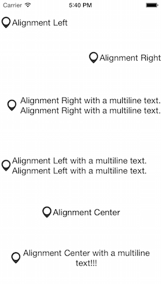

# JT3DScrollView

JT3DScrollView.

## Installation

With [CocoaPods](http://cocoapods.org/), add this line to your Podfile.

    pod 'JT3DScrollView', '~> 1.0'

## Screenshots

## Usage

## Requirements

- iOS 7 or higher
- Automatic Reference Counting (ARC)

## Author

- [Jonathan Tribouharet](https://github.com/jonathantribouharet) ([@johntribouharet](https://twitter.com/johntribouharet))

## License

JT3DScrollView is released under the MIT license. See the LICENSE file for more info.
