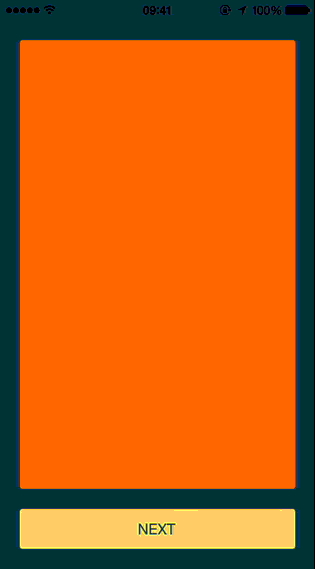

# JT3DScrollView

[](https://travis-ci.org/jonathantribouharet/JT3DScrollView)


JT3DScrollView is a UIScrollView with custom effects during the scroll.

## Installation

With [CocoaPods](http://cocoapods.org/), add this line to your Podfile.

    pod 'JT3DScrollView', '~> 1.0'

## Screenshots




## Usage

You can use it like a classic UIScrollView, the `pagingEnabled` is set to `YES` by default and `clipsToBounds` is set to `NO`.

```objective-c
#import <UIKit/UIKit.h>

#import <JT3DScrollView.h>

@interface ViewController : UIViewController

@property (weak, nonatomic) IBOutlet JT3DScrollView *scrollView;

@end
```

You just have to set the effect.

```objective-c
@implementation ViewController

- (void)viewDidLoad
{
    [super viewDidLoad];

    self.scrollView.effect = JT3DScrollViewEffectCards;
}

@end

```

You can disable the effect and act like a classic `UIScrollView` by setting `effect` to `JT3DScrollViewEffectNone`.

Effects are just preset for some properties used for the animations, you can adjust all effects with:

- `angleRatio`
- `rotationX`
- `rotationY`
- `rotationZ`
- `translateX`
- `translateY`

All this properties are relative to the position X of the subview.

## Requirements

- iOS 7 or higher
- Automatic Reference Counting (ARC)

## Author

- [Jonathan Tribouharet](https://github.com/jonathantribouharet) ([@johntribouharet](https://twitter.com/johntribouharet))

## License

JT3DScrollView is released under the MIT license. See the LICENSE file for more info.
